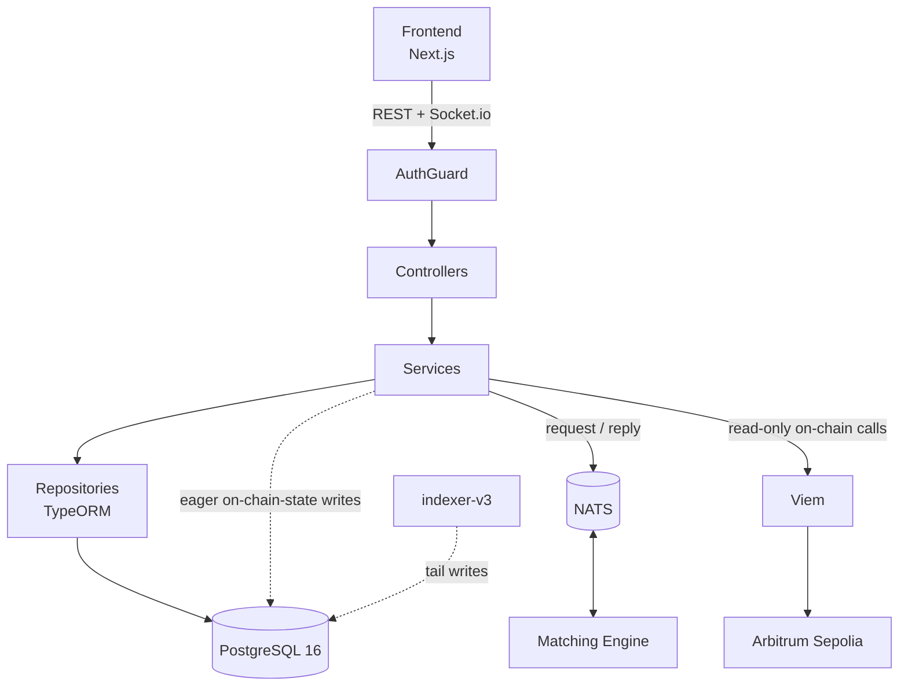

# Centuari · Backend API

The public-facing API gateway for the Centuari decentralized lending protocol. A
NestJS service that authenticates users, validates and routes orders to the
matching engine, serves market/portfolio/price data, and pushes real-time
updates to the frontend over WebSocket.

This is one of nine services in the Centuari system. For the big picture and how
the services fit together, see the [umbrella README](https://github.com/centuari-labs/centuari).

---

## What this service does

- **Authentication** — verifies Privy-issued tokens and resolves a wallet
  identity on every request.
- **Order intake** — validates lend/borrow orders (REST + Socket.io), enforces
  health-factor rules, and publishes them to the matching engine over NATS.
- **Read APIs** — markets, portfolio/positions, deposits, withdrawals, repays,
  faucet, prices, token metadata, and historical rates.
- **Real-time** — a Socket.io gateway streams order-book and price updates to
  the UI.
- **Migration authority** — owns the single canonical migration + seed set for
  the shared Postgres database that several services read and write.

## Tech stack

NestJS 11 · TypeScript · TypeORM 0.3 · PostgreSQL 16 · NATS 2 · Socket.io ·
Privy server-auth · Viem · class-validator / class-transformer · Biome · Jest 30 · pnpm

## Architecture



### Request flow

```
Request → AuthGuard → Controller → Service → Repository / NATS / Viem → ResponseInterceptor → Response
```

- **AuthGuard** resolves identity via an `AuthStrategyFactory` → `PrivyAuthStrategy`,
  setting `request.user = { userId, walletAddress }`.
- **Controllers** are thin: validate a `class-validator` DTO, call a service,
  return a plain object. No business logic.
- **Services** orchestrate logic; all DB access goes through repositories (no raw
  SQL in services or gateways).
- A global **ResponseInterceptor** wraps every result into the standard envelope.

### Module layout

```
src/
├── common/          # decorators, guards, interceptors, filters, validators, utils
├── core/            # infrastructure: database, nats, privy, viem, websocket
├── auth/            # Privy-based authentication
├── orders/          # order management (core business logic)
├── market/          # market / pool data
├── portfolio/       # positions, collateral, health-factor accounting
├── deposit/         # deposits
├── withdraw/        # withdrawals
├── repay/           # repayments
├── faucet/          # testnet token distribution
├── price/           # price feeds (CoinGecko)
├── tokens/          # token / asset metadata
├── rate-history/    # historical rate data
├── chain-indexer/   # blockchain indexing integration
└── abi/             # synced contract ABIs (gitignored, regenerated)
```

Each feature is a self-contained NestJS module (`module.ts`, `controller.ts`,
`service.ts`, plus optional `entity` / `repository` / `dto`). Cross-module data
flows by importing the module and injecting its service — never via HTTP.

## Health-factor accounting

Borrow orders are gated on a post-action health factor. The backend reads — but
never writes — `portfolio.locked_amount` (the matching engine's db-writer
increments it at match time; the settlement engine decrements it at settlement
time). Available balance is computed as
`wallet − portfolio.locked_amount − Σ open orders`, with matched-but-unsettled
borrows folded in as in-flight debt so the HF check can't be gamed during the
match → settlement window.

The per-market safety margin above HF = 1 is configured by
`risk.borrow_buffer_bps` (default 100 bps → threshold 1.01), aggregated
conservatively as the `MAX` over a user's flagged collateral × loan-token rows.

## Idempotent on-chain state

The backend is an *eager-path writer* for shared on-chain-state tables
(`user_balance`, `lend_position`, `borrow_position`, collateral flags). Those
upserts are emitted through the shared
[`@centuari-labs/on-chain-effects`](https://github.com/centuari-labs/on-chain-effects)
mutation helpers and stamped with `applied_by_tx_hash` / `applied_by_log_index`,
so they are identical *by construction* to the indexer's tail writes and cannot
drift.

## Database migrations

backend-v2 is the **single migration authority** for the shared Postgres
database. The schema is two grouped genesis migrations plus one consolidated
seed:

- `genesis_onchain_schema.sql` — shared on-chain-state tables read/written by
  indexer-v3 and settlement-engine.
- `genesis_app_schema.sql` — backend-owned relational tables (accounts, assets,
  risk, orders, matches, …).
- `genesis_seed.sql` — Arbitrum-Sepolia assets + risk matrix.

indexer-v3 does **not** migrate at boot, so `pnpm run migrate` must run before
it starts. Testnet reset: `pnpm run db reset` → `pnpm run migrate` → `pnpm run seed`.

## Contract addresses & ABIs

Addresses live in `.env.contracts` and ABIs in `src/abi/*.json` — both
gitignored and regenerated by the smart-contract repo's
`bin/sync-to-services.sh` after every deploy. `.env` keeps only secrets (RPC
URLs, operator key, `DATABASE_URL`). Verify the service is on the latest
deployment with `./bin/sync-to-services.sh --check`.

## Getting started

```bash
# from the umbrella repo: bring up Postgres / Redis / NATS first
docker-compose up -d postgres redis nats

pnpm install
pnpm run migrate            # backend is the migration authority — run before indexer
pnpm run seed

pnpm run start:dev          # nest start --watch (port 3000, mapped to 3001 in Docker)
```

> The shared `@centuari-labs/on-chain-effects` package is private on GitHub
> Packages — add a PAT with `read:packages` to `~/.npmrc` before installing. See
> the [umbrella README](https://github.com/centuari-labs/centuari) for details.

## Commands

```bash
pnpm run start:dev          # dev server (watch mode)
pnpm run build              # compile
pnpm run test               # unit tests
pnpm run test:integration   # integration tests
pnpm run test:e2e           # e2e tests
pnpm run lint               # biome check --apply
pnpm run format             # biome format --write
pnpm run migrate            # run DB migrations
pnpm run seed               # seed database
```

## Conventions

- **Repository pattern** for all DB access; never raw SQL in services/gateways.
- **DTOs for all input** via `class-validator`; derive related DTOs with
  `PartialType` / `PickType` / `OmitType`.
- **Transactions** via the `withTransaction(dataSource, manager => …)` helper.
- **Plain-object returns** — the global interceptor handles the response shape.
- **NATS, not HTTP**, for backend ↔ matching-engine communication.
- Biome v2.3.4: 4-space indent, 80-char width, LF endings. Run `pnpm run lint`
  before committing.

All services run with `TZ=UTC`; all timestamp columns are `TIMESTAMPTZ`.
