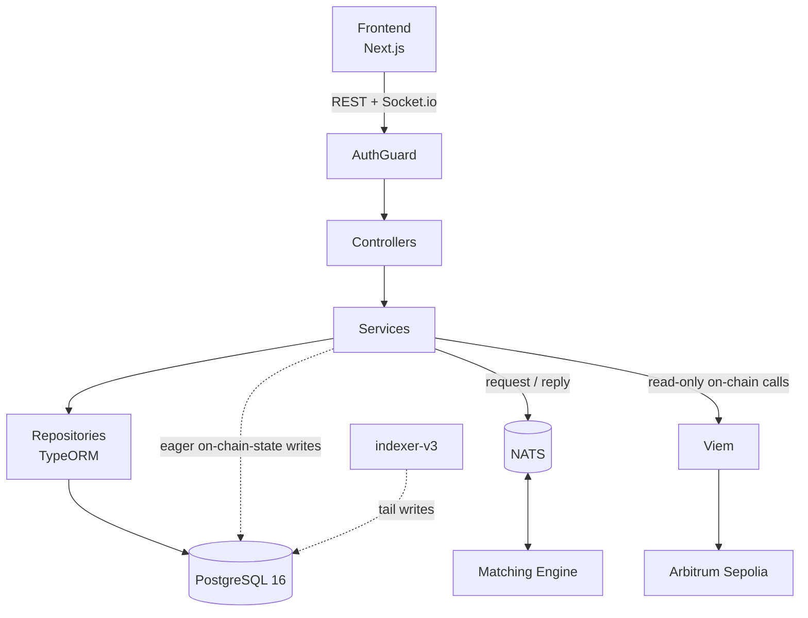

# Centuari · Backend API

The public-facing API gateway for the Centuari decentralized lending protocol. A
NestJS service that authenticates users, validates and routes orders to the
matching engine, serves market/portfolio/price data, and pushes real-time
updates to the frontend over WebSocket.

This is one of Centuari's application services. For the public system map and
the current hub-only launch boundary, see the
[umbrella README](https://github.com/centuari-labs/centuari).

---

## What this service does

- **Authentication:** verifies Privy-issued tokens and resolves a wallet
  identity on protected account and transaction requests. Public health,
  market, token, and price reads do not require a user session.
- **Order intake:** validates lend/borrow orders (REST + Socket.io), enforces
  health-factor rules, and publishes them to the matching engine over NATS.
- **Read APIs:** markets, portfolio/positions, deposits, withdrawals, repays,
  faucet, prices, token metadata, and historical rates.
- **Real-time:** a Socket.io gateway streams order-book and price updates to
  the UI.
- **Migration authority:** owns the single canonical migration + seed set for
  the shared Postgres database that several services read and write.

## Tech stack

NestJS 11 · TypeScript · TypeORM 0.3 · PostgreSQL 16 · NATS 2 · Socket.io ·
Privy server-auth · Viem · class-validator / class-transformer · Biome · Jest 30 · pnpm

## Architecture


```mermaid
flowchart TD
    FE[Frontend<br/>Next.js] -->|REST + Socket.io| GW[AuthGuard]
    GW --> CTRL[Controllers]
    CTRL --> SVC[Services]
    SVC --> REPO[Repositories<br/>TypeORM]
    SVC -->|request / reply| NATS[(NATS)]
    SVC -->|read-only on-chain calls| VIEM[Viem]
    REPO --> PG[(PostgreSQL 16)]
    NATS <--> ME[Matching Engine]
    VIEM --> CHAIN[Arbitrum Sepolia]
    SVC -. eager on-chain-state writes .-> PG
    IDX[indexer-v3] -. tail writes .-> PG
```

### Request flow

```
Request → AuthGuard → Controller → Service → Repository / NATS / Viem → ResponseInterceptor → Response
```

- **AuthGuard** resolves identity via an `AuthStrategyFactory` → `PrivyAuthStrategy`,
  setting `request.user = { userId, walletAddress }`.
- **Controllers** are thin: validate a `class-validator` DTO, call a service,
  return a plain object. No business logic.
- **Services** orchestrate logic; all DB access goes through repositories (no raw
  SQL in services or gateways).
- A global **ResponseInterceptor** wraps every result into the standard envelope.

### Module layout

```
src/
├── common/          # decorators, guards, interceptors, filters, validators, utils
├── core/            # infrastructure: database, nats, privy, viem, websocket
├── auth/            # Privy-based authentication
├── orders/          # order management (core business logic)
├── market/          # market / pool data
├── portfolio/       # positions, collateral, health-factor accounting
├── deposit/         # deposits
├── withdraw/        # withdrawals
├── repay/           # repayments
├── faucet/          # testnet token distribution
├── price/           # price feeds (CoinGecko)
├── tokens/          # token / asset metadata
├── rate-history/    # historical rate data
├── chain-indexer/   # blockchain indexing integration
└── abi/             # synced contract ABIs (gitignored, regenerated)
```

Each feature is a self-contained NestJS module (`module.ts`, `controller.ts`,
`service.ts`, plus optional `entity` / `repository` / `dto`). Cross-module data
flows by importing the module and injecting its service rather than calling it
over HTTP.

## Health-factor accounting

Borrow orders are gated on a post-action health factor. The backend reads
`portfolio.locked_amount` but never writes it (the matching engine's db-writer
increments it at match time; the settlement engine decrements it at settlement
time). Available balance is computed as
`wallet − portfolio.locked_amount − Σ open orders`, with matched-but-unsettled
borrows folded in as in-flight debt so the HF check can't be gamed during the
match → settlement window.

The per-market safety margin above HF = 1 is configured by
`risk.borrow_buffer_bps` (default 100 bps → threshold 1.01), aggregated
conservatively as the `MAX` over a user's flagged collateral × loan-token rows.

## Idempotent on-chain state

The backend is an *eager-path writer* for shared on-chain-state tables
(`user_balance`, `lend_position`, `borrow_position`, collateral flags). Those
upserts are emitted through the shared
[`@centuari-labs/on-chain-effects`](https://github.com/centuari-labs/on-chain-effects)
mutation helpers and stamped with `applied_by_tx_hash` / `applied_by_log_index`,
so they are identical *by construction* to the indexer's tail writes and cannot
drift.

## Database migrations

backend-v2 is the **single migration authority** for the shared Postgres
database. The current migration set includes two genesis migrations, later
schema amendments, and one consolidated seed:

- `20260602000000_genesis_onchain_schema.sql`: shared on-chain-state tables
  read/written by
  indexer-v3 and settlement-engine.
- `20260602000100_genesis_app_schema.sql`: backend-owned relational tables (accounts, assets,
  risk, orders, matches, …).
- `20260602010000_add_liquidation_event.sql`: liquidation event support.
- `20260604000000_add_applied_by_chain_id.sql`: chain-scoped idempotency
  stamps for reorg-safe tail writes.
- `20260602000000_genesis_seed.sql`: Arbitrum-Sepolia assets + risk matrix.

indexer-v3 does **not** migrate at boot, so `pnpm run migrate` must run before
it starts. `pnpm run seed` applies seed files that have not been recorded in
`seeds_log` yet.

> **Local/test databases only:** `pnpm run db reset` rolls back every applied
> migration and then re-runs the migration set. It can destroy the database
> schema and data. Never run it against a shared, staging, or production
> database; back up any disposable local data you need first.

## Contract addresses & ABIs

Addresses live in `.env.contracts` and ABIs in `src/abi/*.json`; both
gitignored and regenerated by the `smart-contract-revamp` repository's
`bin/sync-to-services.sh` after every deploy. `.env` keeps runtime settings and
secrets (RPC URLs, operator key, `DATABASE_URL`, and Privy credentials). From a
sibling checkout, verify this service is on the latest deployment with:

```bash
cd ../smart-contract-revamp
./bin/sync-to-services.sh --network=arb-sepolia --check
```

## Getting started

Provide local PostgreSQL, Redis, and NATS instances first; the public umbrella
repository is documentation-only and does not ship a shared Compose stack.

```bash
cp .env.example .env
# Set DATABASE_URL, PRIVY_APP_ID, PRIVY_PROJECT_SECRET, and CORS_ORIGINS.
# Set SUPPORTED_CHAINS=421614 and RPC_421614 for the Arbitrum Sepolia launch.
# Keep operator keys empty unless you are intentionally exercising a
# testnet-only write path. Never commit .env or place a private key in a command.

# From a sibling checkout, generate the ignored contract addresses and ABIs:
cd ../smart-contract-revamp
./bin/sync-to-services.sh --network=arb-sepolia
cd ../backend-v2

# Before installing, configure a read-only GitHub Packages token in your user
# ~/.npmrc. The repository .npmrc only maps the @centuari-labs scope; it does
# not contain credentials. Keep the token out of this repository and its logs.
pnpm install

# The backend owns the shared schema. Use a disposable local/test database.
pnpm run migrate            # run pending migrations
pnpm run seed               # apply the genesis seed once

pnpm run start:dev          # nest start --watch (port 3000)
```

Set the Postgres, Redis, and NATS URLs in `.env`. When following the manual
migration commands above, set `MIGRATIONS_ON_START=false` and
`SEED_ON_START=false` in `.env`; the example file enables both for disposable
local development and boot-time failures are intentionally surfaced.

> The shared `@centuari-labs/on-chain-effects` package is private on GitHub
> Packages and requires a token with `read:packages`. Keep that token in your
> user-level `~/.npmrc` and out of the repository.

## Commands

```bash
pnpm run start:dev          # dev server (watch mode)
pnpm run build              # compile
pnpm run test               # unit tests
pnpm run test:integration   # integration tests
pnpm run test:e2e           # e2e tests
pnpm run lint               # biome check --write
pnpm run format             # biome format --write
pnpm run migrate            # run DB migrations
pnpm run seed               # seed database
```

## Conventions

- **Repository pattern** for all DB access; never raw SQL in services/gateways.
- **DTOs for all input** via `class-validator`; derive related DTOs with
  `PartialType` / `PickType` / `OmitType`.
- **Transactions** via the `withTransaction(dataSource, manager => …)` helper.
- **Plain-object returns:** the global interceptor handles the response shape.
- **NATS, not HTTP**, for backend ↔ matching-engine communication.
- Biome v2.3.4: 4-space indent, 80-char width, LF endings. Run `pnpm run lint`
  before committing.

All services run with `TZ=UTC`; all timestamp columns are `TIMESTAMPTZ`.
